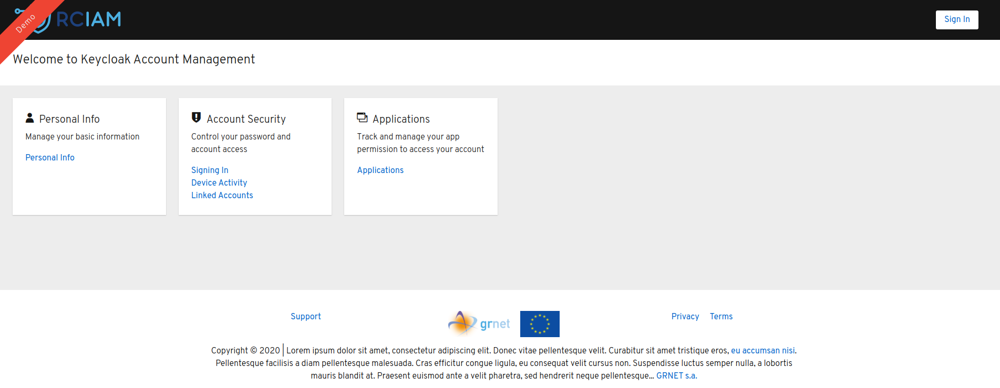

# keycloak-theme-vanilla

This is the vanilla theme for rciam installations.

:red_circle: **IMPORTANT**:
Please note that this theme needs a custom modification on core keycloak code in order to work. 
The [theme releases](https://github.com/rciam/keycloak-theme-vanilla/releases) are compatible with these [keycloak releases](https://github.com/eosc-kc/keycloak/releases), as presented in the compatibility matrix [at the end of this page](https://github.com/rciam/keycloak-theme-vanilla/edit/master/README.md#compatibility-matrix)

Contact the development team for instructions.

## Screenshots

### Login theme


### Account theme


## Installation instructions:

### Releases 1.x.x

Create the following folders:
$KEYCLOAK_BASE/modules/system/layers/keycloak/org/keycloak/keycloak-theme-vanilla
$KEYCLOAK_BASE/modules/system/layers/keycloak/org/keycloak/keycloak-theme-vanilla/main

and add into the folder "main"
* the built jar keycloak-theme-vanilla/target/keycloak-theme-vanilla.jar
* the keycloak-theme-vanilla/module.xml from the source (this one) base folder

so you should end up with the following structure in
$KEYCLOAK_BASE/modules/system/layers/keycloak/org/keycloak/keycloak-theme-vanilla

```
keycloak-theme-vanilla
└── main
    ├── keycloak-theme-vanilla.jar
    └── module.xml
```

Following the above, we should also let wildfly server and keycloak to load this module as well.
So, open file $KEYCLOAK_BASE/standalone/configuration/standalone.xml

Find the ```<subsystem xmlns="urn:jboss:domain:keycloak-server:1.1">``` node.

* Add the
  ```<provider>module:org.keycloak.keycloak-theme-vanilla</provider>```
  into the ```<providers>``` list
* Add the
    ```
    <modules>
        <module>org.keycloak.keycloak-theme-vanilla</module>
    </modules>
    ```
  into the ```<theme>``` block

### Releases 2.0.0+

Download the keycloak-theme-vanilla.jar from the [releases page](https://github.com/rciam/keycloak-theme-vanilla/releases).

Just drop the jar file into the $KEYCLOAK_BASE/standalone/deployments/ folder.

Wait for wildfly to auto-deploy the jar file.


## Modifying the theme at runtime (for releases  >= 2.0.0 )

Since v.2.0.0, the theme has two different ways to edit its configuration per realm.

### Way 1

An admin could edit the generated files under the $KEYCLOAK_BASE/standalone/theme-c`onfig folder.

For each realm it maintains two files:
* a **terms-of-use/<REALM_NAME>.html** file which contains the html file with the realm-specific terms of use
* a **configurations/<REALM_NAME>.json** file which contains the json file with the realm-specific theme configuration

### Way 2

Alternatively, an admin could use the following endpoints:

* https://<HOST_NAME>/auth/realms/<REALM_NAME>/theme-info/terms-of-use  (HTTP-GET or HTTP-POST to fetch or set/update the theme's terms of use for the realm)
* https://<HOST_NAME>/auth/realms/<REALM_NAME>/theme-info/theme-config  (HTTP-GET or HTTP-POST to fetch or set/update the theme's config for the realm)

Both endpoints require for the HTTP-POST a valid admin token (Authorization: "Bearer <VALID_ADMIN_TOKEN>"), or the call will be rejected with a http 401 code.

The expected body payload for the POST requests should be similar to the termsofuse.html file (that's the theme's default terms of use file) and the configuration.json file (that's the default template configuration).


## Adding static files  (for releases  >= 4.0.0 )

Since v.4.0.0, the theme has the ability to serve static files (any filetype), just like a fileserver.

The theme also uses a cache to speed up file serving for the most commonly requested files, with size smaller than 1ΜΒ. Larger than 1MB files are always fetched from the filesystem. 

There are 2 ways to define the files to serve (a) by uploading them as a multipart/form-data on each keycloak node, or (b) by adding them into a folder under the $KEYCLOAK_BASE/standalone/theme-config/resources/<REALM_NAME>/

### Way 1

To set/register a file into the embedded file repo, you need to send a POST request at the endpoint

**https://<HOST_NAME>/auth/realms/<REALM_NAME>/theme-info/resource/<FILE_NAME>**

with a single form key (with any key name, since key name is ignored) containing the file. 

**NOTE:** This must be issued on each node of keycloak. So, this will not work if you are sending this at a reverse proxy / load balancer serving more than 1 nodes.

To get the registered file, you can achive that by sending a HTTP GET request at the same endpoint 

**https://<HOST_NAME>/auth/realms/<REALM_NAME>/theme-info/resource/<FILE_NAME>**


### Way 2

If you have access to the running keycloak node instance, you can add a file at runtime under the folder  

**$KEYCLOAK_BASE/standalone/theme-config/resources/<REALM_NAME>/**

and the keycloak theme will pick up any file instantly (it utilizes file listerners). 


## Compatibility matrix

This theme is compatible with the custom releases of keycloak which can be found [here](https://github.com/eosc-kc/keycloak/releases) 

|  Theme version | Keycloak version |
|---|---|
|  v1.0.0 | v15.0.2-r1.0.(1-4) |
|  v1.1.0 | v15.0.2-r1.0.(1-4) |
|  v1.2.0 | v15.0.2-r1.0.5 + |
|  v2.0.0 | v15.0.2-r1.0.6 + |
|  v2.1.0 | v15.0.2-r1.0.6 + |
|  v2.2.0 | v15.0.2-r1.0.6 + |
|  v2.3.0 | v16.1.0-rc1.0.1 + |
|  v3.0.0 | v16.1.0-rc1.0.1 + |
|  v3.0.1 | v16.1.0-rc1.0.1 + |
|  v4.0.0 | v16.1.0-rc1.0.1 + |

## License

* Apache License, Version 2.0 - see LICENCE file


