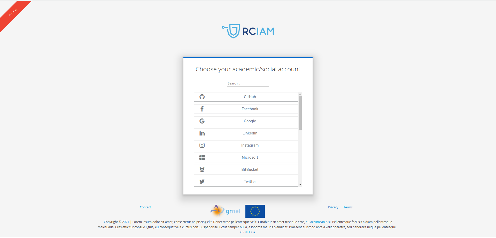

# keycloak-theme-vanilla

This is the vanilla theme for rciam installations.

:red_circle: **IMPORTANT**:
Please note that this theme needs a custom modification on core keycloak code in order to work. Contact the development team for instructions.

## Screenshot

    
## Installation instructions:

### Releases 1.x.x

Create the following folders:
$KEYCLOAK_BASE/modules/system/layers/keycloak/org/keycloak/keycloak-theme-vanilla
$KEYCLOAK_BASE/modules/system/layers/keycloak/org/keycloak/keycloak-theme-vanilla/main

and add into the folder "main"
* the built jar keycloak-theme-vanilla/target/keycloak-theme-vanilla.jar
* the keycloak-theme-vanilla/module.xml from the source (this one) base folder

so you should end up with the following structure in
$KEYCLOAK_BASE/modules/system/layers/keycloak/org/keycloak/keycloak-theme-vanilla

```
keycloak-theme-vanilla
└── main
    ├── keycloak-theme-vanilla.jar
    └── module.xml
```

Following the above, we should also let wildfly server and keycloak to load this module as well.
So, open file $KEYCLOAK_BASE/standalone/configuration/standalone.xml

Find the ```<subsystem xmlns="urn:jboss:domain:keycloak-server:1.1">``` node.

* Add the
  ```<provider>module:org.keycloak.keycloak-theme-vanilla</provider>```
  into the ```<providers>``` list
* Add the
    ```
    <modules>
        <module>org.keycloak.keycloak-theme-vanilla</module>
    </modules>
    ```
  into the ```<theme>``` block

### Releases 2.0.0+

Download the keycloak-theme-vanilla.jar from the [releases page](https://github.com/rciam/keycloak-theme-vanilla/releases).

Just drop the jar file into the $KEYCLOAK_BASE/standalone/deployments/ folder.

Wait for wildfly to auto-deploy the jar file.


## Modifying the theme at runtime (for releases  >= 2.0.0 )

Since v.2.0.0, the theme has two different ways to edit its configuration per realm.

### Way 1

An admin could edit the generated files under the $KEYCLOAK_BASE/standalone/theme-config folder.

For each realm it maintains two files:
* a **terms-of-use/<REALM_NAME>.html** file which contains the html file with the realm-specific terms of use
* a **configurations/<REALM_NAME>.json** file which contains the json file with the realm-specific theme configuration

### Way 2

Alternatively, an admin could use the following endpoints:

* https://<HOSTNAME>/auth/realms/<REALM_NAME>/theme-info/terms-of-use  (HTTP-GET or HTTP-POST to fetch or set/update the theme's terms of use for the realm)
* https://<HOSTNAME>/auth/realms/<REALM_NAME>/theme-info/theme-config  (HTTP-GET or HTTP-POST to fetch or set/update the theme's config for the realm)

Both endpoints require for the HTTP-POST a valid admin token (Authorization: "Bearer <VALID_ADMIN_TOKEN>"), or the call will be rejected with a http 401 code.

The expected body payload for the POST requests should be similar to the termsofuse.html file (that's the theme's default terms of use file) and the configuration.json file (that's the default template configuration).


## Compatibility matrix

|  Theme version | Keycloak version |
|---|---|
|  v1.0.0 | v15.0.2-r1.0.(1-4) |
|  v1.1.0 | v15.0.2-r1.0.(1-4) |
|  v1.2.0 | v15.0.2-r1.0.5 + |
|  v2.0.0 | v15.0.2-r1.0.6 + |
|  v2.1.0 | v15.0.2-r1.0.6 + |
|  v2.2.0 | v15.0.2-r1.0.6 + |
|  v2.3.0 | v16.1.0-rc1.0.1 + |

## License

* Apache License, Version 2.0 - see LICENCE file


